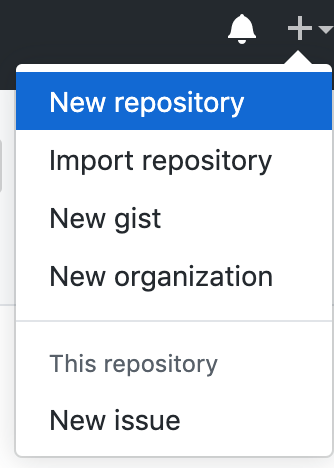

- title : MiniScaffold
- description : MiniScaffold
- author : Jimmy Byrd
- theme : night
- transition : default

***

### Project Zero or Removing barriers for creating OSS libraries

Jimmy Byrd

Codemash 2020

---

### Who am I?

- Team Lead at Binary Defense
- Maintainer of OSS projects
- Contributor to OSS projects

---

### Why are we here?

---

- Act 1
    - Go through the concepts of creating your first OSS library
    - Learning lessons along the way
- Act 2
    - Cover MiniScaffold
- Act 3
    - Create your own scaffold for your ecosystem

---

### Learning Lessons

✅ = Something to add to a checklist for later

***

### You have an idea

<aside class="notes">
    Great idea for a library.  It's going to change the world.
</aside>

---

### Create your repository

---

### Get to coding

---

### Problem solved

--- 

### Shipping 

---

### Project is finished...

***

### Your first issue

A new feature idea

---

### Strangely worded, needs a lot of feedback about the use case

✅ Create an issue template for features

---

### How do I build this thing again?

✅ I should create a script

---

### How do I publish again?

✅ I should add the publishing to this script

*** 

### ✅Checklist

- Create an issue template for features
- Have a build script
    - Have a publish step

***

### Issue #2

That new feature broke something for someone

---

### Time to write tests

✅ I have to choose a testing library

✅ I should add this to the build script

***

### Issue #3

Why does this library exist? How do I get started?

---

### Write a `README.md`

✅ Explain why this library exists

✅ Explain how to get started

***

### Issue #4

Needs a license

---

### Go through the license choosing process

✅ https://choosealicense.com/

***

### Issue #5

I'd like to contribute but how?

---

### Write up a `CONTRIBUTING.md` guide

✅ https://mozillascience.github.io/working-open-workshop/contributing/

- Prerequisites for contributing
- How to build/test
- How to submit a PR

***

### ✅ Checklist

- Create an issue template for features
- Have a build script
    - Have a test step
    - Have a publish step
- Choose a testing library
- Create a README.md
- Choose a License
- Create a CONTRIBUTING.md 

***

### Your first contributor's Pull Request (PR)

Someone just added a new feature

---

### It looks like it works

✅ I have to build it locally, maybe I should create a build server

---

### I have nitpicks about the formatting during review

✅ I should choose a standard formatter for my language

---

### Weird IDE files were added in the commit

✅ I should have a comprehensive `.gitignore` file

***

### ✅ Checklist

- Create an issue template for features/bug reports/pull requests
- Have a build script
    - Have a test step
    - Have a publish step
    - Have a format step
- Choose a testing library
- Create a README.md
- Choose a License
- Create a CONTRIBUTING.md 
- Have Build Server/CI setup
- Have an .editorconfig
- Have a .gitignore

***

### The Issues, they don't stop coming

- ✅ API Documentation
- ✅ Release Notes/Changelog
- ✅ GitHub releases
- ✅ Standardizing project structure
- ✅ Ecosystem specific features

***

### ✅ Checklist

-  Have a standard codebase structure
    -  ISSUE/PULL_REQUEST templates
    -  src folder
    -  tests folder
    -  docs folder (or DOCUMENTATION.md)
    -  dist folder
    -  CHANGELOG/RELEASE_NOTES
    -  CONTRIBUTING
    -  README
        -  Description 
        -  Answers
            -  Who (maintainers)
            -  What (this project does)
            -  Why (this project exists)
            -  How (Basics of getting started, may defer to docs)
    -  LICENSE
    -  CI files
    -  .editorconfig
    -  .gitignore
    -  dependencies
    -  Build script 
        -  Clean distributables/temp folders
        -  Restore packages
        -  Compile (if necessary)
        -  Run tests
        -  Create distributables (npm/nuget)
        -  Create a release commit
        -  Create a git tag
        -  Create a GitHub release
        -  Push distributables to dependency manager host
        -  Format code
        -  Anything else specific to your language/platform
            -  Sourcelink (.NET)
            -  GenerateAssemblyInfo (.NET)
        -  Generate Docs (if necessary)

---

### Big list

*** 

### Enter [MiniScaffold](https://github.com/TheAngryByrd/MiniScaffold)

---

### Whats in the box?

- Standard project structure for dotnet projects
- [FAKE](https://fake.build/) for build automation
- [Paket](https://fsprojects.github.io/Paket/) for dependency management
- [Expecto](https://github.com/haf/expecto) for automated testing
- [AltCover](https://github.com/SteveGilham/altcover) for code coverage
- [Fantomas](https://github.com/fsprojects/fantomas) for code formatting
    - Also a good .editorconfig
- [SourceLink](https://github.com/dotnet/sourcelink) for debugging NuGet packages
- [VSCode](https://code.visualstudio.com/) plugin recommendations
- .gitignore
- [FSharp.Formatting](https://fsprojects.github.io/FSharp.Formatting/) for Documentation Generation
- [TravisCI](https://travis-ci.org/)/[Appveyor](https://www.appveyor.com/)/[GitHub Actions](https://help.github.com/en/actions/automating-your-workflow-with-github-actions/workflow-syntax-for-github-actions) for build servers
- Metadata starting point
    - README
    - RELEASE_NOTES
    - LICENSE
- Simple Release Workflow

---

### Prerequisites

- Install [git](https://git-scm.com/download)
- Install [.Net core](https://dotnet.microsoft.com/download)
- If on macOS or Linux, install [Mono](https://www.mono-project.com/download/stable/)
- If on Windows [ensure](https://docs.microsoft.com/en-us/dotnet/framework/migration-guide/how-to-determine-which-versions-are-installed) you have at least .NET Full Framework 4.6.1 installed
- Recommended IDE is [VSCode with Ionide](https://docs.microsoft.com/en-us/dotnet/fsharp/get-started/install-fsharp#install-f-with-visual-studio-code)
- Create a [NuGet account](https://www.nuget.org/)
- Create a [GitHub account](https://github.com/)
- Create a [TravisCI account](https://travis-ci.org)
- Create an [Appveyor account](https://www.appveyor.com/)

---

### Installing MiniScaffold

Install the [dotnet template](https://docs.microsoft.com/en-us/dotnet/core/tools/custom-templates) from NuGet:

    [lang=bash]
    dotnet new -i "MiniScaffold::*"

---

### Use the template

Then use the template to create your own library.  Replace `MyCoolNewLib` with your own library name and `MyGithubUsername` with your own GitHub name. If you have trouble picking a library name then [generate one](https://colinmorris.github.io/rbm/repos/).

    [lang=bash]
    dotnet new mini-scaffold -n MyCoolNewLib --githubUsername MyGithubUsername
    cd MyCoolNewLib

---

### Running your first build

    [lang=bash]
    $ ./build.sh

    ... lots of output

    ---------------------------------------------------------------------
    Build Time Report
    ---------------------------------------------------------------------
    Target                   Duration
    ------                   --------
    Clean                    00:00:00.2265025
    DotnetRestore            00:00:15.0755658
    DotnetBuild              00:00:14.9643742
    DotnetTest               00:00:06.2235803
    GenerateCoverageReport   00:00:00.8268912
    DotnetPack               00:00:14.4001064
    Total:                   00:00:51.8780989
    Status:                  Ok
    ---------------------------------------------------------------------

---

### Making a Release (prereqs)

- [Setup git upstream](https://help.github.com/en/github/importing-your-projects-to-github/adding-an-existing-project-to-github-using-the-command-line)
- [Setup NuGet apikey](https://fsprojects.github.io/Paket/paket-config.html#Adding-a-NuGet-API-key)
- [Setup GitHub apikey](https://help.github.com/en/github/authenticating-to-github/creating-a-personal-access-token-for-the-command-line)
- Add to `RELEASE_NOTES.md`

    #### 0.2.0 - 2017-04-20
    - FEATURE: Does cool stuff!
    - BUGFIX: Fixes that silly oversight

---

### Making a Release

    [lang=bash]
    $ ./build.sh Release

***

# Demo

***

### Next steps

- Use dotnet? 
    - Try out MiniScaffold
- Use another language/framework?
    - use my checklist as a way to craft your own!
